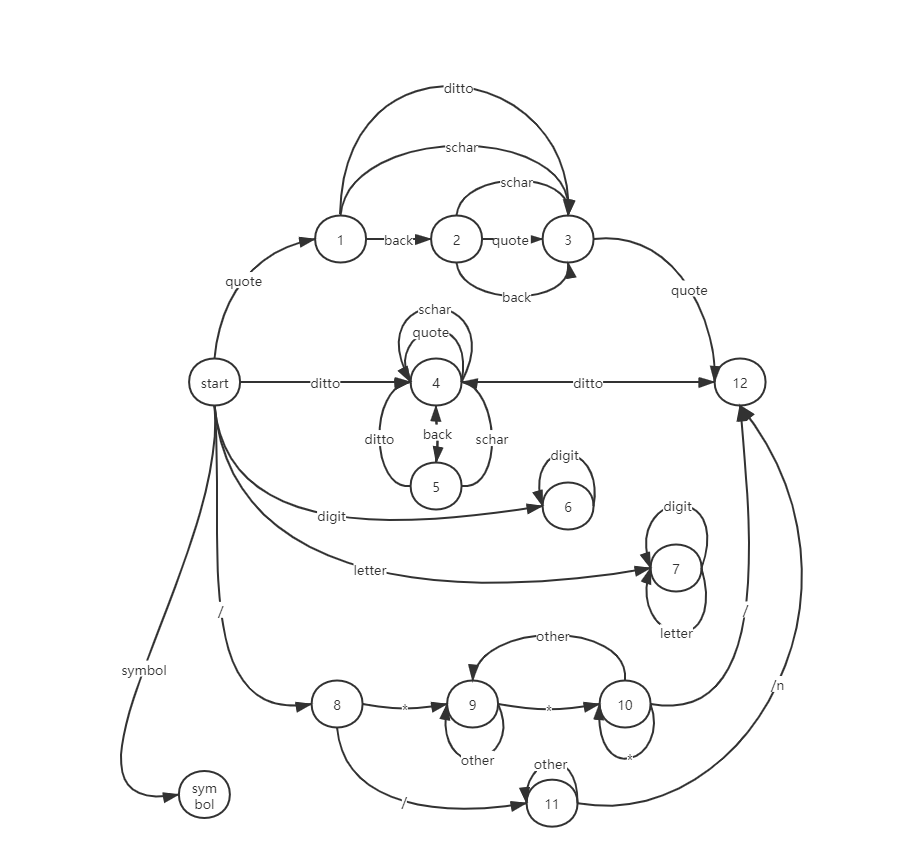
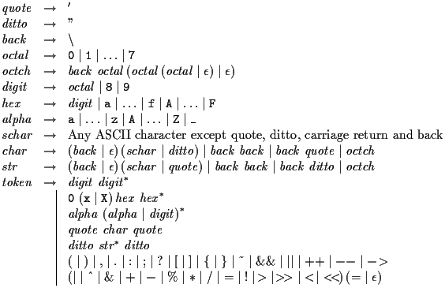

# C-   compilier
> 课程设计  

## 更新
采用modern C++ 11 重构了词法解析器代码,逻辑更为清晰,封装优良,使用简单

## 说明

目前更新了词法分析器

---

##  词法分析器   *lexical analyzer*

- **DFA**  

  

- **正则表达式 *regular expression***  

  

  > 只保留了十进制,暂时只保留了单目操作符   	

- **错误处理 *error handling***

  > 接收到不可识别的错误字符后，终止程序，输出：error  + (line number)                    
- **没有添加预处理命令**
  
  >暂时不能使用 include，#define 等命令
- **测试 *test program***

  ~~~c++
  int main()
  {
  	char token_char = 'h';
  	cout "hello world" endl;
  	int token_number = 666;
  	int token_number1 = token_number;
  	// this is a comment;
  	/* this is a 
  	   multi-line comments  */
   	return 0;
  }
  ~~~

- **输出 *output***   

  ~~~
  int----INT
  main----ID
  (----LPAREN
  )----RPAREN
  {----LBRACKET
  char----CHAR
  token_char----ID
  =----ASSIGN
  'h'----CHAR_TOKEN
  ;----SEMICOLON
  cout----COUT
  "hello world"----STRING
  endl----ID
  ;----SEMICOLON
  int----INT
  token_number----ID
  =----ASSIGN
  666----NUMBER
  ;----SEMICOLON
  int----INT
  token_number1----ID
  =----ASSIGN
  token_number----ID
  ;----SEMICOLON
  return----RETURN
  0----NUMBER
  ;----SEMICOLON
  }----RBACKET
  ~~~

- **可能出现意外错误  *may encounter unanticipated bug*** 

